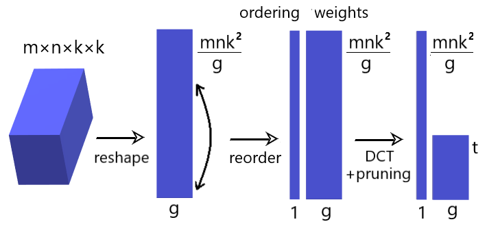

# Tensor Reordering for CNN Compression

This repository provides implementation of the paper [**Tensor Reordering for CNN Compression**](https://arxiv.org/abs/2010.12110) in PyTorch.



Compressed ResNet-50 accuracy on ImageNet validation set:

|  Model  | Parameters | Trainable par. | Top-1 % | Top-5 % |
| :-----: | :--------: | :------------: | :-----: | :-----: |
| Original | 25.6M | 25.6M | 76.15 | 92.87 |
| g=4, r'=0.125 | 15.4M | 8.9M | 76.69 | 93.27 |
| g=4, r'=0.25 | 12.0M | 5.5M | 76.53 | 93.20 |
| g=4, r'=1.0 | 8.2M | 1.7M | 76.16 | 92.96 |
| g=8, r'=0.5 | 6.5M | 3.2M | 75.21 | 92.36 |
| g=8, r'=1.0 | 5.0M | 1.7M | 73.02 | 91.37 |
| g=8, r'=1.0 (20ep) | 5.0M | 1.7M | 74.77 | 92.27 |

Compressed MobileNet-V2 accuracy on ImageNet validation set:

|  Model  | Parameters | Trainable par. | Top-1 % | Top-5 % |
| :-----: | :--------: | :------------: | :-----: | :-----: |
| Original | 3.5M | 3.5M | 71.87 | 90.29 |
| g=4, r'=0.25 | 2.8M | 1.7M | 71.80 | 90.47 |
| g=4, r'=0.5 | 2.2M | 1.2M | 71.70 | 90.38 |
| g=4, r'=1.0 | 1.8M | 0.8M | 71.51 | 90.34 |
| g=4, r'=2.0 | 1.5M | 0.4M | 70.94 | 89.89 |
| g=4, r'=4.0 | 1.3M | 0.2M | 69.64 | 89.18 |

## Presentation Video

https://user-images.githubusercontent.com/7396993/121437578-df0c7880-c982-11eb-9618-12cbda153cf6.mp4

## Compressing Models

Currectly ResNet-50 and MobileNet-V2 models from torchvision repository are supported. Mandatory parameters are architecture `-a`, parameter `-g` from the paper and coefficient compression rate `-r`. To compress ResNet-50 with `g=8` and 4-times coefficient compression rate run:
```
python compress.py -a resnet50 -g 8 -r 4.0
```
Another example of compressing MobileNet-V2 with progressive compression with `g=4`, `r'=0.5`, specifying output file name: 
```
python compress.py -a mobilenet_v2 -g 4 -r 0.5 --progressive --out checkpoint_name.pth
```

## Testing Models

The compressed MobileNet-V2 with the same set of hyperparameters can be tested on ImageNet validation set as follows:
```
python test.py /path/to/imagenet/ checkpoint_name.pth -a mobilenet_v2 -g 4 -r 0.5 --progressive
```

## Finetuning Compressed Models

Finetune the ResNet model with the suggested learning rate for one epoch (assuming 1 GPU):
```
python train.py -a resnet50 -g 8 -r 4.0 --resume compressed-resnet50-uniform-8-4.0.pth --batch-size 64 --lr 0.00025 --epochs 1
```
And MobileNet-V2 as:
```
python train.py /path/to/imagenet/ -a mobilenet_v2 -g 8 -r 1.0 --progressive --resume checkpoint_name.pth --batch-size 64 --lr 0.0001 --epochs 1
```

## Requirements

Tested on Python 3.5+, PyTorch 1.1+
Install the required packages by running:
```
pip install -r requirements.txt
```

The train and test scripts are based on the pytorch example code from https://github.com/pytorch/examples/tree/master/imagenet and ResNet and MobileNet definitions are modified from Torchvision repository https://github.com/pytorch/vision/tree/master/torchvision/models

## Cite
```
@misc{ulicny2020tensor,
      title={Tensor Reordering for CNN Compression}, 
      author={Matej Ulicny and Vladimir A. Krylov and Rozenn Dahyot},
      year={2020},
      eprint={2010.12110},
      archivePrefix={arXiv},
      primaryClass={cs.LG}
}
```
